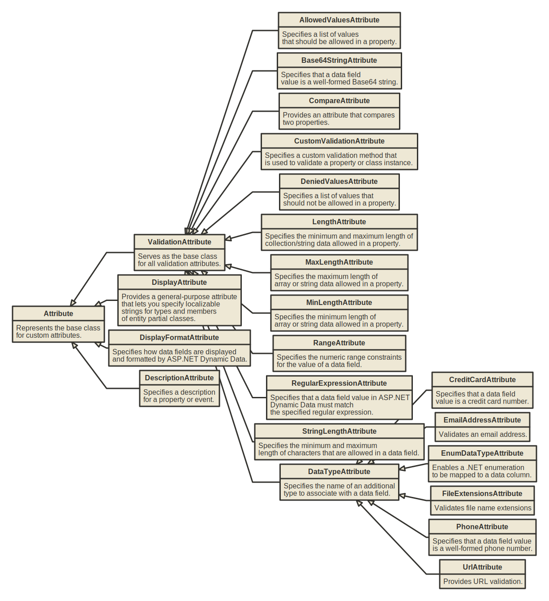

# Attributes

^^^

^^^ Common Attributes

## Data annotation

^^^

^^^ Data annotation Attributes

## Nullable attributes

In a nullable enabled context, the compiler performs static analysis of code to determine the null-state of all reference type variables:

* not-null: Static analysis determines that a variable has a non-null value.
* maybe-null: Static analysis can't determine that a variable is assigned a non-null value.

Attributes can be aplied to our code that gives the compiler more information about the rules for your API. When calling code is compiled in a nullable enabled context, the compiler will warn callers when they violate those rules. These attributes don't enable more checks on your implementation.

### Preconditions: AllowNull and DisallowNull

* `AllowNull`: A non-nullable parameter, field, or property may be null.
* `DisallowNull`: A nullable parameter, field, or property should never be null.

```csharp
[AllowNull]
public string ScreenName
{
    get => _screenName;
    set => _screenName = value ?? GenerateRandomScreenName();
}
private string _screenName = GenerateRandomScreenName();

[DisallowNull]
public string? ReviewComment
{
    get => _comment;
    set => _comment = value ?? throw new ArgumentNullException(nameof(value), "Cannot set to null");
}
string? _comment;
```

### Postconditions: MaybeNull and NotNull

* `MaybeNull`: A non-nullable parameter, field, property, or return value may be null.
* `NotNull`: A nullable parameter, field, property, or return value will never be null.

```csharp
[return: MaybeNull]
public T Find<T>(IEnumerable<T> sequence, Func<T, bool> predicate)
{
    //implementation
}

public static void ThrowWhenNull([NotNull] object? value, string valueExpression = "")
{
    _ = value ?? throw new ArgumentNullException(nameof(value), valueExpression);
}
```

## #Conditional post-conditions: NotNullWhen, MaybeNullWhen, and NotNullIfNotNull

* `NotNullWhen`: A nullable argument won't be null when the method returns the specified `bool` value.
* `MaybeNullWhen`: A non-nullable argument may be null when the method returns the specified `bool` value.
* `NotNullIfNotNull`: A return value, property, or argument isn't null if the argument for the specified parameter isn't null.

```csharp
bool TryGetMessage(string key, [NotNullWhen(true)] out string? message)
{
    if (_messageMap.ContainsKey(key))
        message = _messageMap[key];
    else
        message = null;
    return message is not null;
}

[return: NotNullIfNotNull(nameof(url))]
string? GetTopLevelDomainFromFullUrl(string? url)
{
    //implementation
}

```

### MemberNotNull and MemberNotNullWhen

* `MemberNotNull`: The listed member won't be null when the method returns.
* `MemberNotNullWhen`: The listed member won't be null when the method returns the specified bool value.

```csharp
public class Container
{
    private string _uniqueIdentifier; // must be initialized.
    private string? _optionalMessage;

    public Container()
    {
        Helper();
    }

    public Container(string message)
    {
        Helper();
        _optionalMessage = message;
    }

    [MemberNotNull(nameof(_uniqueIdentifier))]
    private void Helper()
    {
        _uniqueIdentifier = DateTime.Now.Ticks.ToString();
    }
}
```

### DoesNotReturn and DoesNotReturnIf

* `DoesNotReturn`: A method or property never returns. In other words, it always throws an exception.
* `DoesNotReturnIf`: A method or property never returns if the associated bool parameter has the specified value.

```csharp
[DoesNotReturn]
private void FailFast()
{
    throw new InvalidOperationException();
}

public void SetState(object containedField)
{
    if (containedField is null)
    {
        FailFast();
    }

    // containedField can't be null:
    _field = containedField;
}
```